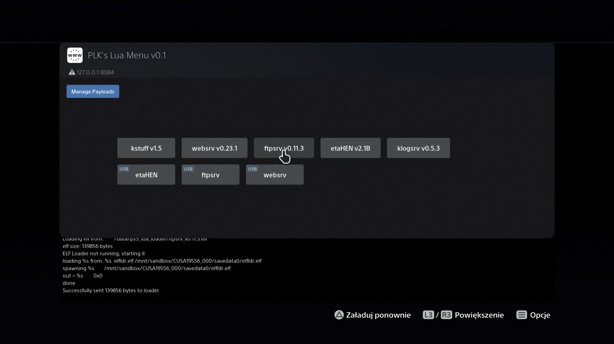
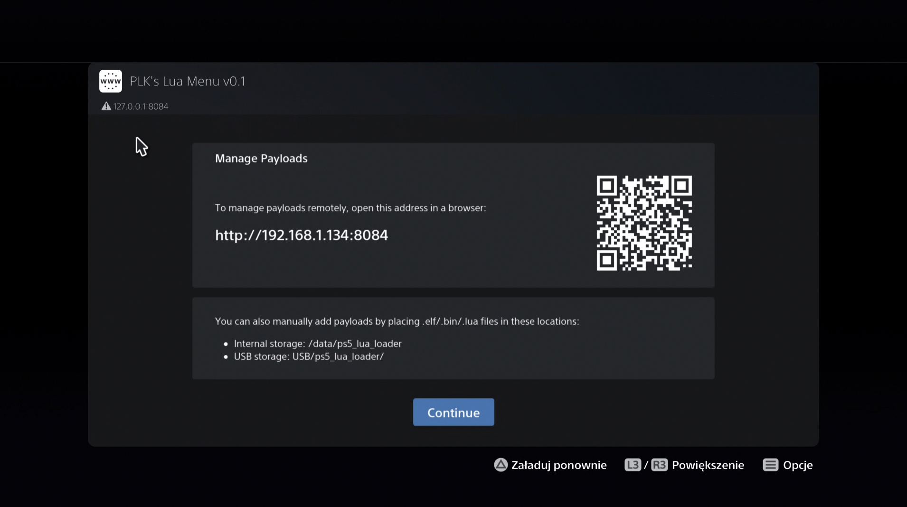
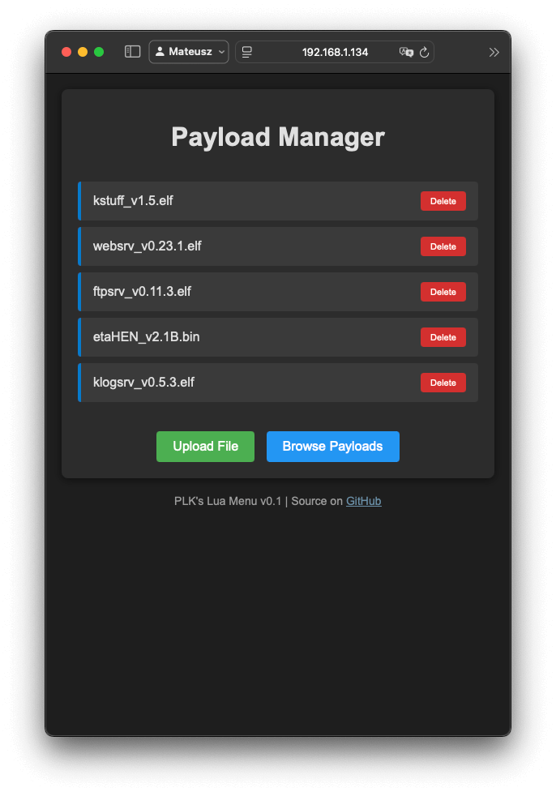
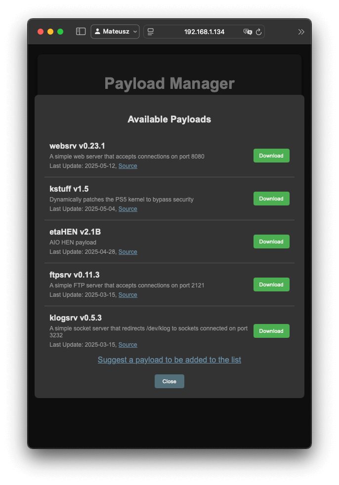

# PS5 Lua Web-Menu

A web-based menu for jailbroken PlayStation 5 consoles.

List and launch payloads directly via the PS5's web browser.    
Manage payloads using a web browser on another device on the same network.

The menu looks for payloads (.elf, .bin, .lua files) in the `/mnt/usb*/ps5_lua_loader/` directory on connected USB drives.    
Payloads added through the manage page will be saved in `/data/ps5_lua_loader/` on the PS5's internal storage.

## 🚀 Quick Start

1.  **Download:** Get the latest `ps5_lua_menu.lua` from the **Releases Page**.
2.  **Launch:**
    *   Use **[Remote Lua Loader](https://github.com/shahrilnet/remote_lua_loader)** to send and execute `ps5_lua_menu.lua` on your PS5.
    *   Alternatively, use **[ps5_lua_loader](https://github.com/itsPLK/ps5_lua_loader)** to automatically start this menu.
3.  **Access:**
    *   The script will open your PS5's web browser for listing/launching payloads.
    *   To manage payloads, open `http://<PS5_IP>:8084` in a browser on another device (PC, phone) on the same network.


## 🖼️ Screenshots

<p align="center">
  
  
</p>
<p align="center">
  
  &nbsp; &nbsp; &nbsp; &nbsp;
  
</p>


## 🛠️ Building from Source (Optional)

If you prefer to build the menu yourself:

1.  Clone the repository:
    ```bash
    git clone https://github.com/itsPLK/ps5_lua_menu.git
    cd ps5_lua_menu
    chmod +x build.sh
    ```
2.  **Build:**    
    To generate `ps5_lua_menu.lua`:
    ```bash
    ./build.sh
    ```
    Or to generate `ps5_lua_menu.lua` and send it automatically to remote loader:
    ```bash
    ./build.sh send:<PS5_IP>:<PORT>
    ```
